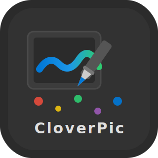

<p align="center">
  
</p>

<h1 align="center">VividPic</h1>

<p align="center">
  <a href="README.md">中文</a> | <a href="README.en.md">English</a> | <a href="README.ja.md">日本語</a>
</p>

> ⚠️ **声明：本项目为个人学习项目，仅用于技术探索与练习，不代表最终商业产品质量。**

## 简介

VividPic 是一款面向插画师与漫画作者的纯 C++ 原生 Windows 绘画软件。项目采用自研轻量级 UI 框架与渲染管线，在 Windows 10/11 上提供低延迟、高保真的绘画体验。

目前处于活跃开发阶段，已实现基础画布引擎、完整图层系统（含文字图层）、笔刷引擎、数位板双栈支持、选择工具、变换工具、形状工具、文字工具、滤镜系统与文件 I/O，以及大量交互体验优化（Tooltip、Toast、右键菜单、Tab 导航、面板折叠、OLE 拖放、Splitter 拖拽等）。

## 核心特性

- **纯原生实现**：基于 Win32 API 与 Direct2D，无 Qt/Electron 等外部 UI 框架依赖
- **自研渲染管线**：CPU 软合成 + D2D 硬显示，256×256 TileGrid 分块内存管理，支持 Copy-on-Write
- **专业图层系统**：18 种混合模式，支持不透明度、可见性、锁定、保护透明度与 Solo 模式
- **图层多态架构**：`RasterLayer`（像素绘画）+ `TextLayer`（可编辑文字，DirectWrite 栅格化缓存）
- **笔刷引擎**：5 种笔头（RoundHard / RoundSoft / Flat / Bristle / Texture），支持 flow、wetMix、spacing 与压力映射
- **完整工具集**：笔刷、橡皮、吸管、油漆桶、渐变、移动、套索/矩形/椭圆/魔棒选择、变换、文字、形状
- **数位板双栈支持**：Windows Ink API（优先）+ WinTab API（Fallback）+ Mouse 兜底，完整支持压感、倾斜与旋转
- **滤镜系统**：6 个破坏性滤镜（亮度/对比度、色相/饱和度、高斯模糊、锐化、反相、阈值）+ FilterDialog 参数对话框
- **文件 I/O**：`.vvp` 自定义二进制格式（VVP v1/v2 双版本兼容）+ WIC PNG 导出
- **撤销/重做**：`HistoryManager` + `StrokeUndoItem` 双快照机制，50 步上限
- **内存感知系统**：新建画布前自动计算安全内存预算，绿/黄/红三色仪表盘提示
- **暗色主题 UI**：DPI 自适应缩放（`Theme::Scale`），支持 100%~200% DPI 设置
- **最近文件**：`RecentFilesManager` 自动记录最近 10 个打开的文件
- **可拖拽面板布局**：Workspace 支持左右面板的浮动与停靠
- **面板折叠/展开**：5 个面板（颜色/笔刷/图层/导航器/笔刷尺寸）支持标题栏一键折叠
- **Splitter 拖拽**：左右面板宽度可拖拽调整（160~400px），实时响应
- **Tooltip 提示**：工具栏 13 个图标支持 500ms 延迟 Tooltip
- **Toast 反馈**：保存/导出/撤销/重做等操作底部弹出 2 秒 Toast
- **右键上下文菜单**：CanvasView 右键支持全选/反选/清除选区
- **Tab 键导航**：Button/EditBox/ComboBox 支持 Tab 焦点循环
- **OLE 拖放**：支持从资源管理器直接拖拽 `.vvp` 文件到 Workspace 打开
- **Marching Ants 动画**：选区边界黑白虚线流动动画
- **HomeScreen 转场**：Workspace 切换时 150ms 淡入淡出过渡
- **响应式布局**：窗口自适应主显示器 85% 工作区，最小 1024×768

## 技术栈

| 类别 | 技术 |
|------|------|
| 语言 | C++20 |
| 平台 | Windows 10/11 (x64) |
| 编译器 | MinGW-w64 GCC 13.1.0 |
| 构建系统 | CMake 3.25+ / Ninja |
| 渲染 | Direct2D / WIC / GDI+ |
| 文字 | DirectWrite（系统字体枚举 + 文字栅格化） |
| 输入 | Windows Ink API / WinTab |
| 标准库 | STL / `std::filesystem` |

## 快速构建

### 环境要求

- Windows 10/11 x64
- CLion（推荐，bundled CMake + MinGW + Ninja）
- 或手动安装 MinGW-w64 GCC 13+ 与 CMake 3.25+

### CLion 内构建（推荐）

1. 使用 CLion 打开项目根目录
2. 确认 Toolchain 指向 bundled MinGW
3. 点击 **Build**（Ctrl+F9）或 **Run**（Shift+F10）

### 命令行构建

```powershell
# 确保 MinGW\bin 在 PATH 中
$env:PATH = "C:\Users\CloverIris\AppData\Local\Programs\CLion\bin\mingw\bin;$env:PATH"

cmake -B cmake-build-debug -G Ninja -DCMAKE_BUILD_TYPE=Debug
cmake --build cmake-build-debug
```

## 项目结构

```
VividPic/
├── src/
│   ├── App/          # Application 单例、消息泵、生命周期
│   ├── Core/         # Project, Layer(抽象基类), RasterLayer, TextLayer, LayerManager, BlendMode, MemoryAdvisor, SelectionMask, Filters, History, ProjectIO, RecentFilesManager
│   ├── Render/       # RenderBackend, D2DCanvas, TilePool, BrushEngine, BrushPreset, FontManager
│   ├── Tablet/       # TabletInput（WindowsInkDriver + WinTabDriver + TabletManager）
│   ├── UI/
│   │   ├── Core/     # Window, Theme, ToolType, 消息分发基类
│   │   ├── Widgets/  # Button, Panel, EditBox, ComboBox, CanvasView
│   │   ├── Panels/   # BrushPanel, BrushSizePanel, ColorsPanel, LayersPanel, NavigatorPanel, ToolBar
│   │   ├── Dialogs/  # TextInputDialog, FilterDialog
│   │   └── Screens/  # HomeScreen, NewCanvasDialog, Workspace
│   └── Utils/        # Types（String、Point、Rect、Size、Color 等）
├── assets/           # 运行时资源
├── PRD.md            # 产品需求文档
├── UI.md             # UI 设计规范
└── AGENTS.md         # 开发约束与进度
```

## 开发路线图

| 里程碑 | 状态 | 内容 |
|--------|------|------|
| M1 | ✅ | 基础框架、HomeScreen、Window/Theme 系统 |
| M2 | ✅ | 画布引擎、Direct2D 渲染、Workspace、基础笔刷 |
| M3 | ✅ | TileGrid 图层系统、18 种混合模式、面板布局、快捷键 |
| M4 | ✅ | 完整笔刷引擎、5 种笔头、BrushPanel、WinTab 支持 |
| M5 | ✅ | 选择工具、变换、填充、渐变、文字工具、导航器、Solo 模式、ToolBar 同步 |
| M6 | ✅ | 文件 I/O（.vvp v1/v2 / PNG）、历史/撤销、滤镜、文字图层保存 |
| M6.5 | ✅ | 交互体验增强：Tooltip、Toast、右键菜单、Tab 导航、面板折叠、ScrollView、OLE 拖放、Splitter 拖拽、Marching Ants、转场动画 |
| M7 | ⏳ | 云端同步、延时摄影、导出功能 |
| M8 | ⏳ | 国际化、设置面板、性能优化 |

## 许可证

本项目为个人学习作品，目前暂无开源许可证。代码仅供学习参考。

---

<p align="center">Made with ❤️ for learning.</p>
